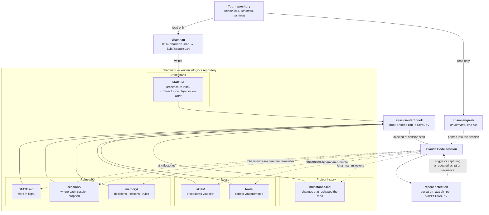

# Architecture

How chamnan is put together, and what actually moves between the parts.

Solid arrows are what chamnan does. Dotted arrows are things that happen because you or Claude
asked for them — which is most of the *Remember* and *Reuse* stores, because a script cannot know
what a session was about or which decision mattered.

Two things the grouping does not say, and the prose below does:

- **Workflows is a detector, not a store.** `lib/workflows.py` notices the same commands running in
  the same order on a third separate day and suggests writing them down; what gets written is a
  procedure in `skills/`. It has no directory of its own.
- **Not everything above reaches a session whole.** The Impact section sits below `MAP.md`'s
  `## Full Detail` marker and is never injected; `memory/decisions` and `memory/lessons` contribute
  a title each; `milestones.md` contributes two. See [What Claude consumes](#what-claude-consumes).

## What runs locally

All of it. chamnan is Python scripts on your machine, run by Claude Code as hooks and by you as
shell commands. There is no service to sign up for, no daemon, and no account.

It uses the Python standard library and nothing else — no third-party packages at install time or
run time. It makes no network calls of its own, and it never invokes `git`. The one exception to
"nothing outside `.chamnan/`" is opt-in: `chamnan-map --install-git-hook` writes a `pre-commit`
hook, and only when you ask for it.

There is no vector database, no embedding model, and no index server. The map is a Markdown file,
and finding something in it is `grep`.

## What is generated

Everything chamnan produces lives in one directory at the root of the repository it is pointed at:

| | written by | when |
|---|---|---|
| `.chamnan/MAP.md` | `chamnan-map` | every index run — rewritten in full |
| `.chamnan/config.json` | `lib/workspace.py` | first run; merged, not replaced, on upgrade |
| `.chamnan/STATE.md` | **Claude, not a script** | at milestones, when there is something worth carrying forward |
| `.chamnan/sessions/` | `/chamnan:resume` | at the end of a stretch of work that did not finish; pruned per `session_retention_days` |
| `.chamnan/memory/` | `/chamnan:remember` | when the reasoning behind something would be expensive to reconstruct. **Not pruned by age** |
| `.chamnan/milestones.md` | `/chamnan:milestone` | after a change that reshaped the repository. Appended, never rewritten |
| `.chamnan/skills/` | `/chamnan:capture` | when you decide a procedure is worth keeping |
| `.chamnan/tools/` | `chamnan-promote` | when a scratch script has earned a permanent place |
| `.chamnan/logs/` | the commands themselves | pruned on every run, per `log_retention_days` |

`MAP.md` has two halves and the split is the point. Above `## Full Detail` is the Quick Index —
one line per file, plus a section each for the data model, API surface, configuration, deployment
and stored files, and only for the ones the repository actually has. Below it is the per-file
detail, which is meant to be grepped for a single heading and never read whole.

Whatever the scanner is about to write passes through `lib/redact.py` first. That is one choke
point on the finished document rather than one per section, so a section added later cannot slip
past it.

## What Claude consumes

At the start of every session in that repository, `hooks/session_start.py` assembles one block and
hands it over:

- the **Quick Index** from `MAP.md` — capped by `index_token_budget`, and folded down by directory
  rather than truncated when it does not fit, so no part of the repository disappears silently
- the **rules** in `memory/rules/`, in full — they are standing constraints, so they belong in front
  of the agent before it starts
- a **title each** for `memory/decisions/` and `memory/lessons/`, and the **two most recent titles**
  from `milestones.md` — enough to know what is there and load the right one
- the **unfinished part** of the newest session record: what was remaining, and what blocked. A
  session that finished cleanly contributes nothing
- **`STATE.md`**, if it exists
- the **names and descriptions** of anything in `skills/` and `tools/` — not their contents, so the
  agent knows what is available and loads one only when it needs it
- a reply-style instruction, only if `reply_style` is set to something other than `off`

Every one of those can be switched off independently in `.chamnan/config.json`.

Measured with all of them populated on a small repository: **507 tokens**. That is the number the
design is built around — almost everything is a name and a pointer, because injecting the bodies
would spend on every session what is needed on a few.

The Full Detail half of `MAP.md` — including the **Impact** section — is **never** injected.
Neither is the source. `chamnan-peek` is separate from all of this: it reads one file's shape when
a task genuinely needs it, and only when it is invoked.

## What chamnan does not do

Worth stating plainly, because an indexing tool sitting between a repository and a model invites
assumptions:

- It does not send your code anywhere. It has no network path of its own.
- It does not filter what Claude reads. A plugin hook cannot rewrite what the `Read` tool returns,
  so if you ask Claude to open a file, it opens it — chamnan is not in that path and is not a
  sandbox. See [data-flow.md](data-flow.md) for where that boundary actually falls.
- It does not modify your source. The scanner opens files read-only. The one thing that can edit
  source is the `commenter` agent, which runs only after you say yes to it during
  `/chamnan:bootstrap`.
