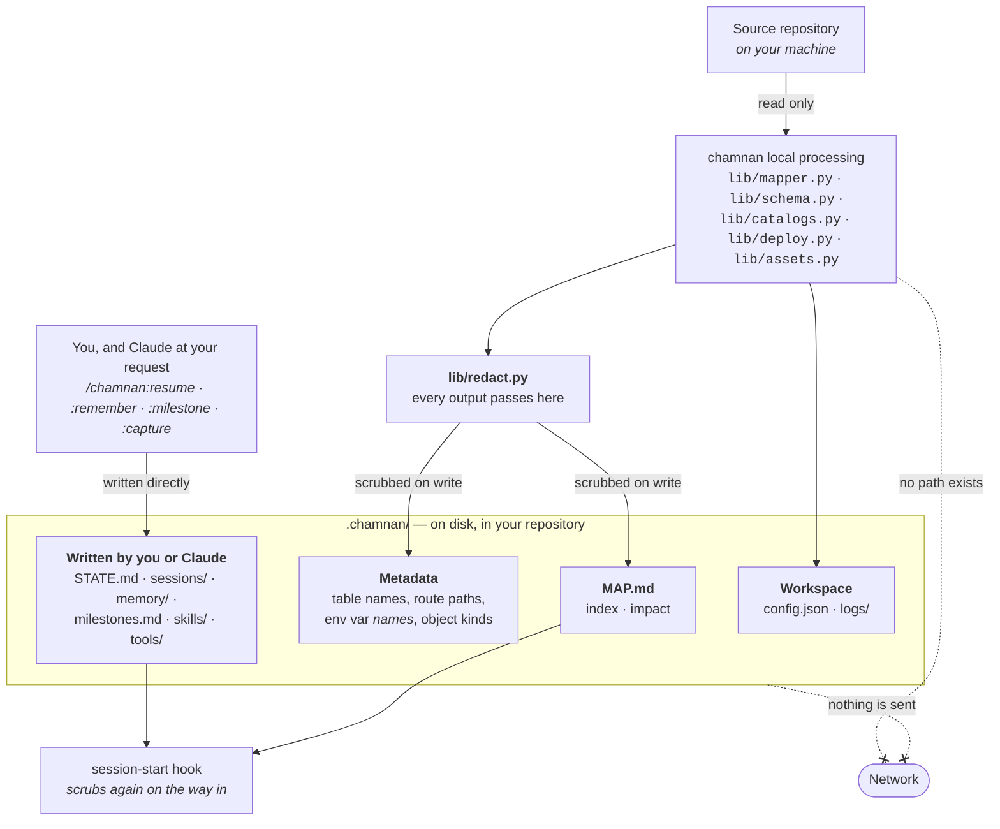

# Data flow

Where your code goes when chamnan runs, and where it does not.

Every arrow that exists stays inside your machine. The two crossed arrows are the point of the
diagram: chamnan has no network code, so there is no path from the scanner or from `.chamnan/` to
anywhere off-disk.

The split down the middle matters. **The scanner writes `MAP.md` and the metadata sections**, and
everything it writes is scrubbed on the way out. **You and Claude write the rest** — the state
file, session records, memory and milestones — directly, without the scanner in the path, so those
are scrubbed on the way *in* instead, as the hook reads them.

## Processing happens locally

The scanner is Python running on your machine, using only the standard library. It opens files
read-only, extracts what it needs, and writes to `.chamnan/`.

There is no network call anywhere in the plugin — not for telemetry, not for updates, not for
analysis. There is no service, no account, and no key to configure. The only process chamnan ever
starts is a second copy of Python to run its own session-start hook, which is what
`chamnan-map --preview` does so you can see what a session would receive.

It DOES invoke `git`, read-only, from six modules — churn ranking, the map's commit stamp and
its freshness check, build-output detection, the timeline, and the session-record fallback.
The claim that it does not was corrected in the README and left standing here. The one thing
it writes outside `.chamnan/` is a `pre-commit`
hook, and only when you ask for it with `chamnan-map --install-git-hook`.

## What is generated

| | contains | does **not** contain |
|---|---|---|
| `MAP.md` — index | one line per file, taken from that file's opening comment; function and class names | file bodies, function bodies, or any code |
| Metadata sections | table and column names, route methods and paths, Kubernetes object kinds and names, Ansible and Compose file paths | row data, request payloads, Secret contents |
| Configuration section | environment variable **names** | environment variable **values** — the patterns match the name and stop at the `=`, so a value is never captured |
| `STATE.md` | whatever Claude writes about work in progress | anything a script put there — no script writes this file |
| `sessions/` | what was unfinished at the end of a stretch of work | the conversation; the record is a summary you or Claude wrote |
| `memory/` | decisions, lessons and standing rules — the reasoning behind the code | anything added without you asking for it |
| `milestones.md` | changes that reshaped the repository, and why | status, owners or dates-as-deadlines; this is not project management |
| `skills/`, `tools/` | procedures and scripts you chose to keep | anything added without you asking |
| `logs/` | what commands ran and when | pruned on every run, per `log_retention_days` |

Whatever is about to be written passes through `lib/redact.py` first — one choke point on the
finished document rather than one per section, so a section added later cannot slip past it. The
same redactor runs on the way **in**: `STATE.md`, session records, memory rules and milestone titles
are scrubbed as the session-start hook reads them, because those are free text about the repository
and therefore the likeliest place for a hostname or a pasted connection string to land.
Provider tokens, private-key blocks, credentialed URLs and secret-shaped assignments become
`<REDACTED>`. Kubernetes Secrets contribute their **name**, so you know one exists, and nothing
underneath it.

Some files are never opened by the scanner at all: `.pem`, `.key`, `.pfx`, `.p12`, `.crt`, `.cer`,
`.jks`, `id_rsa*`, `.htpasswd`, `.netrc`, `*.db`, `*.sqlite`, `*.bak`, `*.dump` and similar.
`chamnan-peek` keeps its own, narrower refusal list — it will show a database's schema, because
table names are not a secret, but it refuses keys and credential files outright.

## What is not sent externally

Nothing, by chamnan.

That sentence is worth reading precisely, because chamnan is a plugin inside Claude Code and the
two are different programs. chamnan writes files to your disk. What Claude Code then does with
your repository — including sending file contents to the API when it reads them — is Claude Code's
behaviour, unchanged by whether this plugin is installed.

What installing chamnan changes is the *shape* of that: a session that starts with an index tends
to read fewer whole files, because it already knows where things are. That is a consequence of
better navigation, not a control, and it is not a guarantee about any particular session.

## chamnan is not a sandbox

Stated in the README and repeated here because it is the single most important thing to be clear
about:

> **chamnan is not a sandbox, and this is not defence in depth for your session.** It defends the
> one thing it controls: its own output. A plugin hook cannot rewrite what the `Read` tool returns
> — `PostToolUse` exposes only `additionalContext` and `systemMessage` — so no plugin can filter
> what Claude reads from your disk. If you ask Claude to open `.env`, it opens `.env`, and chamnan
> is not in that path.

Two further limits, also from the README:

- The redaction patterns are **narrow by design**, and narrow means some things get through. A
  credential in a shape nobody has seen before, or a bare high-entropy string with no assignment
  around it, will not match. Widening until nothing escapes would replace commit hashes, UUIDs and
  version strings too, and an index full of `<REDACTED>` is not an index.
- **Review `MAP.md` before its first commit**, the same way you would review any generated file you
  are about to publish.

See the README's `## Secrets` section for the full statement, and
[architecture.md](architecture.md) for how the pieces fit together.
